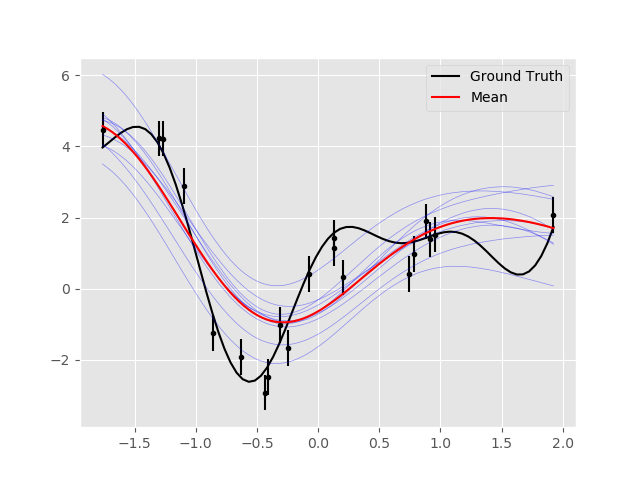
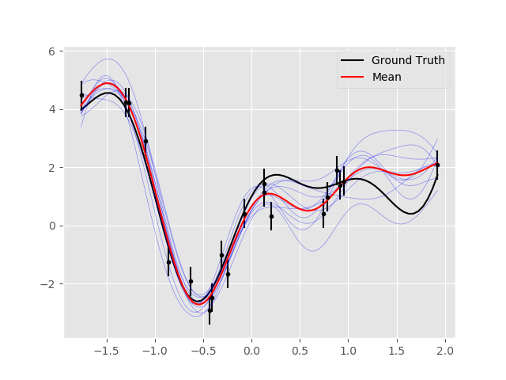
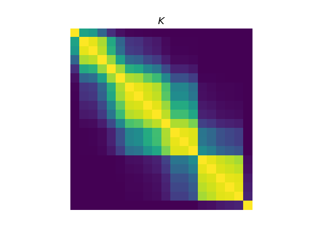
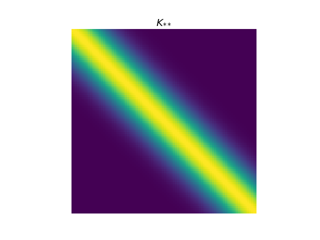

# Gaussian Process

Implementation of a Gaussian Process model. This code is based the examples described in Kevin Murphy’s, Machine Learning: A Probabilistic Perspective and this [lecture](http://courses.media.mit.edu/2010fall/mas622j/ProblemSets/slidesGP.pdf).

Unoptimised Kernel Parameters             |  Optimised Kernel Parameters
:----------------------------------------:|:-------------------------:
                    |  
                               |  

