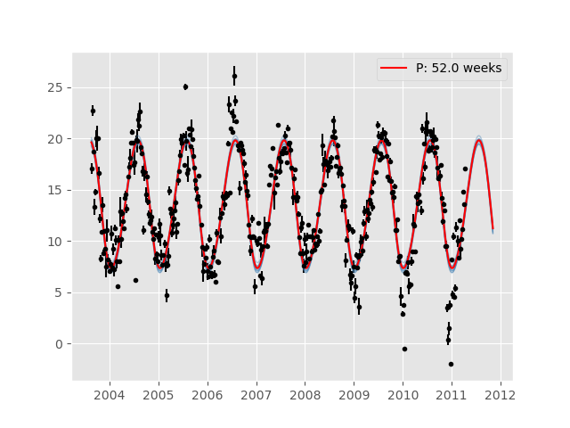

# Gaussian Process

Implementation of a Gaussian Process model. This code is based the examples described in this appendix of [Rasmussen and Williams](http://www.gaussianprocess.org/gpml/chapters/RWA.pdf) and this [lecture](http://courses.media.mit.edu/2010fall/mas622j/ProblemSets/slidesGP.pdf).

 

